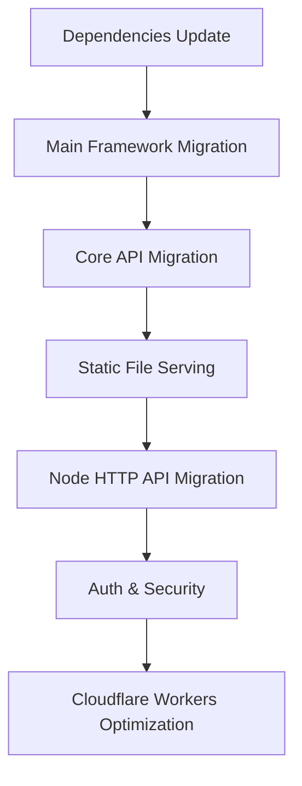

# Node-RED Cloudflare Workers Migration Plan

## Project Overview

Migration plan to run Node-RED v0.2.0 on Cloudflare Workers environment by migrating from Express to Hono framework.

## Migration Goals

- **From**: Express 4 + Node.js v24 (Server-side)
- **To**: Hono + Cloudflare Workers (Edge Computing)

## Phase 1: Express to Hono Migration

### 1.1 Current Express Dependencies Analysis

#### Main Express Usage Locations

1. **Main Application**
   - `red.js:18` - `var express = require("express")`
   - `red/ui.js:16` - `var express = require('express')`

2. **HTTP Routing**
   - `red/server.js:43,49,61` - API endpoints (`/nodes`, `/flows`)
   - `red/ui.js:36,44` - UI endpoints (`/`, `/icons/:icon`)

3. **Node-specific HTTP Endpoints**
   - `nodes/core/58-debug.js:103` - `RED.app.post("/debug/:id")`
   - `nodes/core/20-inject.js:79` - `RED.app.post("/inject/:id")`
   - `nodes/io/21-httpin.js:34,36,38,40` - HTTP In node (GET,POST,PUT,DELETE)
   - `nodes/io/25-serial.js:189` - `RED.app.get("/serialports")`
   - `nodes/social/27-twitter.js:154,163,168,186` - Twitter auth APIs

4. **Middleware**
   - Static file serving: `express.static()`
   - Basic authentication: `basic-auth` package
   - Body parser: `body-parser` package

### 1.2 Migration Strategy

#### Phased Migration Approach

**Stage 1: Core Framework Migration**
- [ ] Update package.json dependencies (Express → Hono)
- [ ] Create main application (`red.js`, `red/ui.js`)
- [ ] Implement basic authentication
- [ ] Implement static file serving

**Stage 2: API Endpoints Migration**
- [ ] `/nodes` endpoint
- [ ] `/flows` endpoint (GET/POST)
- [ ] UI routing (`/`, `/icons/:icon`)

**Stage 3: Node-specific HTTP Migration**
- [ ] Debug node API
- [ ] Inject node API
- [ ] HTTP In node (dynamic routing)
- [ ] Serial port API
- [ ] Twitter auth API

**Stage 4: Middleware & Utilities**
- [ ] Body parser implementation
- [ ] CORS support
- [ ] WebSocket support (if needed)

### 1.3 Technical Considerations

#### Express to Hono API Mapping

| Express | Hono |
|---------|------|
| `app.get(path, handler)` | `app.get(path, handler)` |
| `app.post(path, middleware, handler)` | `app.post(path, handler)` |
| `express.static()` | `serveStatic()` middleware |
| `req.body` | `await c.req.json()` |
| `req.params` | `c.req.param()` |
| `res.json(data)` | `c.json(data)` |
| `res.sendFile()` | `c.body()` + proper headers |

#### Cloudflare Workers Constraints

1. **No File System**
   - `flows.json` read/write → KV Storage / D1 Database
   - `package.json` loading → Static imports

2. **Node.js API Limitations**
   - `fs`, `path` modules → Web Standard APIs
   - `util.log` → `console.log` (already fixed)

3. **HTTP Request Limitations**
   - 15MB limit handling
   - Timeout constraints

### 1.4 Implementation Order

### 1.5 Validation Points

- [ ] Editor UI displays correctly
- [ ] Flow save/load functionality
- [ ] Each node operation verification
- [ ] HTTP In/Out node operation
- [ ] Debug functionality
- [ ] Performance measurement

## Phase 2: Cloudflare Workers Optimization

### 2.1 Storage Migration
- [ ] Local files → KV Storage
- [ ] Flow definition persistence
- [ ] Node configuration management

### 2.2 Performance Optimization
- [ ] Reduce cold start time
- [ ] Bundle size optimization
- [ ] Memory usage reduction

### 2.3 Workers-specific Features
- [ ] Durable Objects (state management)
- [ ] WebSocket support
- [ ] Cron Triggers

## Expected Challenges and Solutions

### Technical Challenges

1. **Dynamic Routing**
   - Issue: HTTP In node dynamic path registration
   - Solution: Utilize Hono's dynamic routing features

2. **File System Dependencies**
   - Issue: `flows.json`, `package.json` read/write
   - Solution: KV Storage + static resource conversion

3. **Node.js Compatibility**
   - Issue: Node.js-specific API usage
   - Solution: Replace with Web Standard APIs

### Operational Challenges

1. **Development Environment**
   - Local development (Wrangler)
   - Staging environment
   - Production environment

2. **Monitoring**
   - Error tracking
   - Performance monitoring
   - Usage analytics

## Success Metrics

- [ ] All editor features work on Cloudflare Workers
- [ ] Response time < 200ms (excluding cold starts)
- [ ] 99.9% uptime
- [ ] 100% compatibility with existing flows

---

*Created: 2025-09-26*
*Target: Node-RED v0.2.0 → Cloudflare Workers*
*Tech Stack: Hono + KV Storage + D1*